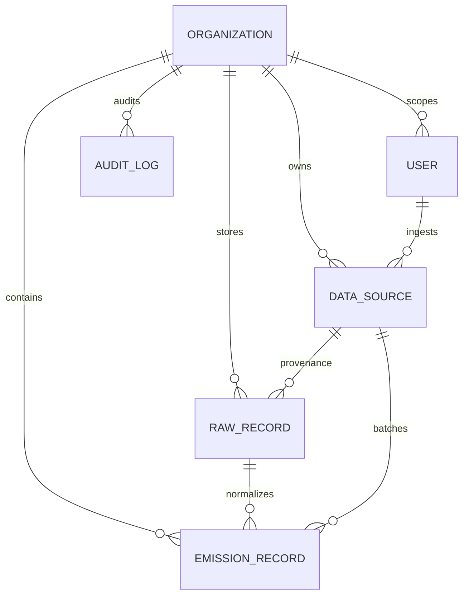

# MODEL.md — breathe_ESG Relational Database Architecture

This document outlines the database design for the breathe_ESG platform, built on PostgreSQL (fallback to SQLite in development) with UUID primary keys.

## 1. Relational Entity Relationship Diagram

## 2. Model Breakdown & Rationale

### A. Organization (`org_organization`)
The tenant root.
* **Why**: Enforces strict multi-tenancy. Every compliance row is tied back to a specific organization.

### B. User (`org_user`)
Custom user model extending `AbstractBaseUser`.
* **Why**: Links users to their target Organization (`PROTECT`) and enforces role permissions (`ADMIN` or `ANALYST`) in memory and database levels.

### C. DataSource (`esg_data_source`)
Metadata about an ingestion batch.
* **Why**: Tracks batch status (`PENDING`, `PROCESSING`, `COMPLETED`, `FAILED`), row count, and any parsing `error_summary` for auditability.

### D. RawRecord (`esg_raw_record`)
**Strictly Immutable.** The compliance source of truth.
* **Why**: Stores unmodified payload payloads exactly as received from the source system.
* **Immutability details**: The `.save()` and `.delete()` methods query database presence and raise `PermissionDenied` to prevent raw data tampering. Has GIN indices on the JSONB payload.

### E. EmissionRecord (`esg_emission_record`)
The normalized business-facing record.
* **Why**: Holds normalized quantities (`quantity_normalized`), units (`unit_normalized`), carbon calculations (`co2e_kg`), confidence scores (`0-100`), YoY anomaly flags, and review status.
* **Locking**: Once set to `LOCKED` by an Admin, the `.save()` method blocks all future updates.

### F. AuditLog (`esg_audit_log`)
**Append-Only.**
* **Why**: Captures who changed what field, when, the `before_value`, `after_value`, and audit notes. Completely read-only in the admin panel.
